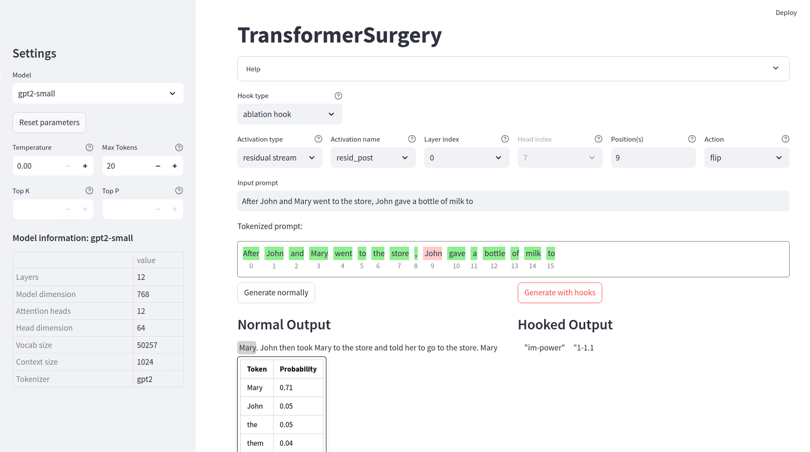

# TransformerSurgery

A Library for perform and visualize brain surgery on transformers using mechanistic interpretability library [TransformerLens](https://github.com/TransformerLensOrg/TransformerLens) by [Bryce Meyer](https://github.com/bryce13950) and created by [Neel Nanda](https://neelnanda.io/about)

With TransformerSurgery you can ablate attentions in a Transfomer model using TransformerLens hooks. You can then generate text and compare it with the unablated model.



## Quick Start

### Install

Create a virtual environment, then do:
```shell
pip install -r requirements.txt
```

### Use

To run the interactive app, just do:

```shell
streamlit run app.py
```

## Features
- load 6 different transformer models
- compare generated text for ablated and unablated models
- ablate attentions in any layer
- ablate head, residual stream or MLP
- only apply to a fixed position
- zero, double or flip attentions
- load and apply custom hooks

## Custom hooks
You can use your custom hooks. Just out your hooks in a new python file in folder `custom_hooks`. The hooks need to fulfill the following conditions:
- the name of the hook has to start with `hook_`
- the hook takes in a torch tensor and returns a torch tensor
- make sure that the hook respects the dimension of the attention (layer) that it is supposed to act on

```python

## License

This project is licensed under the MIT License - see the [LICENSE](LICENSE) file for details